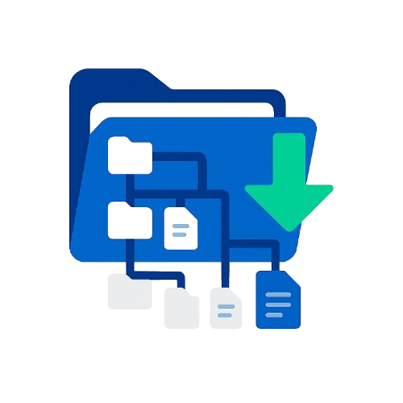

# Directory Structure Exporter

<div align="center">
  
</div>

<p align="center">
  <a href="https://github.com/sponsors/ChromuSx"></a>
  <a href="https://ko-fi.com/chromus"></a>
  <a href="https://buymeacoffee.com/chromus"></a>
  <a href="https://www.paypal.com/paypalme/giovanniguarino1999"></a>
</p>

A comprehensive desktop application for visualizing, filtering, and exporting directory structures in various formats. Built with Python and PyQt6, offering an intuitive graphical interface and powerful filtering options.

> **Development Note**: This project was entirely developed and tested using Claude 4 (Sonnet), Anthropic's latest AI model. Claude 4 demonstrates advanced code architecture, multi-file project management, and sophisticated GUI development capabilities, showcasing state-of-the-art AI-assisted software development.

## 🌟 Key Features

### 📁 Multi-Format Export
- **TXT**: Plain text format for quick viewing
- **HTML**: Navigable web page with CSS styling
- **JSON**: Structured format for programmatic processing
- **XML**: Markup format for integration with other systems

### 🎛️ Advanced Filtering System
- **Excluded directories**: Customizable list of folders to ignore (e.g., `.git`, `node_modules`)
- **Excluded files**: Specific filtering for unwanted files (e.g., `.gitignore`, `thumbs.db`)
- **Included extensions**: Targeted selection for specific file types (e.g., `.py`, `.js`, `.css`)
- **Size filters**: Customizable file size ranges
- **Temporal filters**: Filtering by creation and modification dates
- **Regular expressions**: Advanced patterns for precise filtering

### 📋 Preset Management
- Save and load predefined configurations
- Customizable preset system for different projects
- Import/export configurations in JSON format

### 🌍 Multi-language Support
- **Italian** (default)
- **English**
- **French**
- **German**
- **Spanish**

### 🎨 Customizable Interface
- Light/dark/system themes
- Interactive tree view with lazy loading
- Real-time search functionality
- Drag & drop directory selection
- Context menus for quick actions

## 🛠️ Project Architecture

```
directory-structure-exporter/
├── main.py                      # Application entry point
├── build.py                     # Executable build script
├── core/                        # Main business logic
│   ├── __init__.py
│   ├── exporter.py             # Export engine
│   ├── filters.py              # Filtering system
│   └── config_manager.py       # Configuration and preset management
├── ui/                         # User interface
│   ├── __init__.py
│   ├── main_window.py          # Main window
│   ├── export_tab.py           # Export tab
│   ├── filters_tab.py          # Advanced filters tab
│   └── config_tab.py           # Configuration tab
├── utils/                      # Utilities and services
│   ├── __init__.py
│   ├── file_utils.py           # File operations
│   ├── path_utils.py           # Path management
│   ├── directory_scanner.py    # Asynchronous directory scanning
│   ├── resources.py            # Resource management (icons, assets)
│   └── translation_manager.py  # Translation system
└── translations/               # Translation files (optional)
```

## 🚀 Installation and Usage

### Prerequisites
- Python 3.8 or higher
- PyQt6

### Installing Dependencies
```bash
pip install PyQt6
```

### Running the Application
```bash
python main.py
```

### Building Executable
To create a standalone executable file:

```bash
# Install PyInstaller if not present
pip install pyinstaller

# Run the build script
python build.py
```

The executable will be available in `dist/DirectoryStructureExporter.exe`

## 📖 User Guide

### 1. Basic Export
1. Open the **"Export"** tab
2. Select a directory using the "Browse..." button or drag & drop
3. Choose the output file path and format
4. Click "Export"

### 2. Filter Configuration
In the **"Filters"** tab you can set:
- **File sizes**: Size ranges in bytes
- **Dates**: Creation and modification filters
- **Apply filters**: Enable/disable filter application

### 3. Configuration Management
The **"Configuration"** tab allows you to:
- Add/remove excluded directories
- Manage specific files to exclude
- Configure included extensions
- Use regular expressions for complex patterns
- Save custom presets

### 4. Regular Expression Examples
- `^temp` - Folders starting with "temp"
- `backup$` - Files ending with "backup"
- `.*\.tmp$` - Files with .tmp extension
- `^data_\d+$` - Patterns like "data_123"

## ⚙️ Advanced Configuration

### Configuration Files
Settings are automatically saved through `QSettings`. Presets are stored in JSON files for portability.

### Preset Customization
```json
{
  "excluded_dirs": [".git", ".vs", "node_modules"],
  "excluded_files": [".gitignore", "thumbs.db"],
  "included_file_extensions": [".py", ".js", ".css"],
  "min_file_size": 0,
  "max_file_size": "inf"
}
```

### Performance
- **Lazy Loading**: Progressive loading for large directories
- **Asynchronous Scanning**: Responsive interface during processing
- **Caching**: Optimization for repeated operations

## 🔧 Development

### Adding New Languages
1. Modify `utils/translation_manager.py`
2. Add language code to `available_languages`
3. Insert translations in the `_translations` dictionary

### Extending Filters
To add new filter types:
1. Modify `core/filters.py` for logic
2. Update `ui/filters_tab.py` for interface
3. Extend `core/config_manager.py` for persistence

### New Export Formats
1. Add method in `core/exporter.py`
2. Update interface in `ui/export_tab.py`
3. Test with various directory structures

## 🐛 Troubleshooting

### Common Issues
- **Permission errors**: Run as administrator for system directories
- **Large files**: Set appropriate size limits
- **Slow performance**: Use filters to reduce the number of processed files

### Logging and Debug
The application shows status messages in the bottom bar and informative dialogs for critical operations.

## 📄 License

Project developed for educational and commercial use. Check the license file for specific details.

## 🤝 Contributing

Contributions welcome! For improvement proposals:
1. Fork the project
2. Implement changes
3. Test thoroughly
4. Submit a pull request

## 📞 Support

For issues, bug reports, or feature requests, use the repository's issue system.

---

*Developed entirely with Claude 4 (Sonnet) - Showcasing AI-powered software development*
